# DeepSDF: Learning Continuous Signed Distance Functions for Shape Representation

## Introduction

Representing 3D shapes is an open problem in computer vision and computer graphics. A good 3D shape representation should be suitable for rendering, 3D reconstruction, object recognition, and many more. It should be efficient in terms of memory use and computation speed, while allowing to get competitive quantitative results.

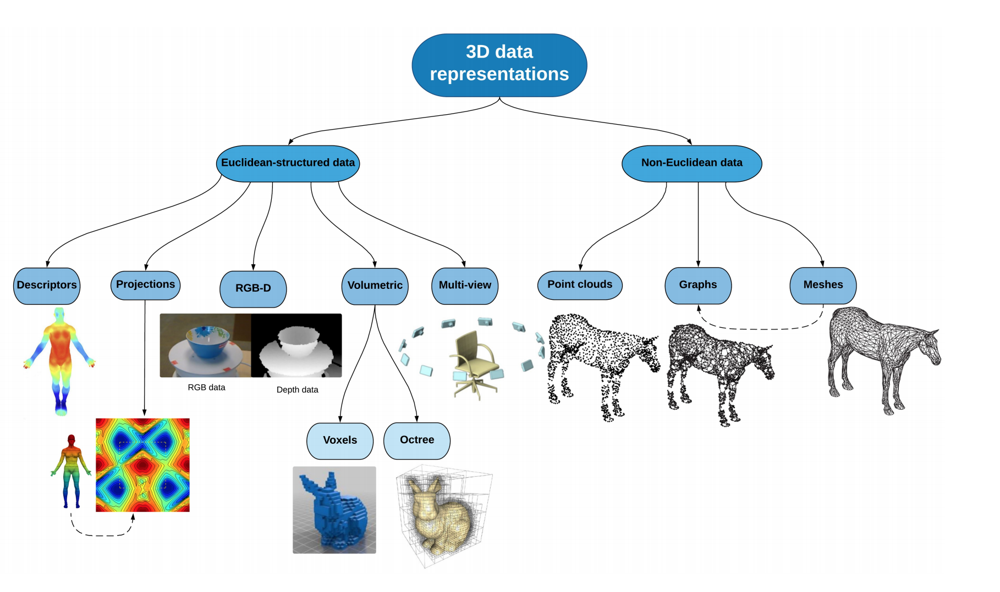
<em>There are many options to represent 3D data[<a href="#c5">5</a>]. Meme source: <a href="https://www.3hatscommunications.com/wp-content/uploads/2016/10/what-do-i-choose-too-many-options.png">3hatscommunications.com</a></em>

In this post, I discuss DeepSDF [<a href="#c1">1</a>], a neural network that learns a popular 3D shape representation method (signed distance functions or SDFs). Compared to voxel-grids that are commonly used to represent discrete SDFs, DeepSDF learns a continuous SDF function that can represent structured 3D data much more memory-efficiently and without discretization errors. Different from the memory-efficient compact surface representations like meshes and point clouds, DeepSDF keeps the accuracy and structure of euclidian grid representations.

[DeepSDF paper](http://openaccess.thecvf.com/content_CVPR_2019/papers/Park_DeepSDF_Learning_Continuous_Signed_Distance_Functions_for_Shape_Representation_CVPR_2019_paper.pdf) came from Facebook Reality Labs researchers <i>Jeong Joon Park, Peter Florence, Julian Straub, Richard Newcombe, Steven Lovegrove</i> and published at CVPR 2019.

### What is a Signed Distance Function (SDF)?

Let's start with what a signed distance function (SDF) is. It is a function that takes a point (a 3D point in our case) and gives its signed distance to the closest surface. The sign of this distance is `+` if the point is inside the surface, `-` otherwise. The surface is the region where the function takes the value `0`, also known as the function's zero level-set. Note that in shape representation, we assume the shape is a single closed (watertight) surface.

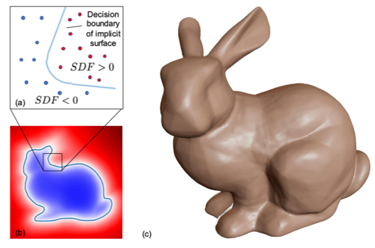
 
<em>Signed distance functions represent surfaces as a 0-level-set of a function [<a href="#c1">1</a>].</em>

Signed-distance functions can represent surfaces smoothly. If we consider two points, one with `+` and one with `-` signed distance, we can locate a point in the surface by computing their weighted average. Sampling multiple points near the surface, we can obtain a set of very precise locations for surface points. In general, rendering can be done with well-known algorithms, such as ray-casting and Marching Cubes [<a href="#c12">12</a>]. Last, but not least, [open-source software](https://github.com/christopherbatty/SDFGen) is available to create SDFs.

### DeepSDF Motivations
SDFs are awesome! However, to be used in practical applications, they need to be discretized and stored as voxels (3D images). Voxels are very inefficient in terms of disk space, memory use and computation. Therefore, we have to discretize too much for efficiency, at the expense of losing details.

DeepSDF people instead suggest learning the continuous SDFs with a neural network. An SDF looks a lot like a nonlinear binary classifier, and neural networks are very good nonlinear classifiers!

### DeepSDF Contributions
DeepSDF authors propose a novel generative model to represent continuous signed distance functions. They show this model outperforms strong baselines in several shape representation challenges. In this section, I give a high-level description of their main contributions. Don't worry if some details are not clear after reading this section, further details will be given in the `Methodology` part.

At a high level, authors first define an embedding lookup, where each shape in a shape category has an embedding latent vector. They then train a single deep fully-connected neural network (MLP) per shape category. The network takes the embedding vector and a 3D point as the input, and gives signed distance value as the output. New embedding vectors can be obtained for unknown shapes via interpolation or by optimizing for a new embedding vector.

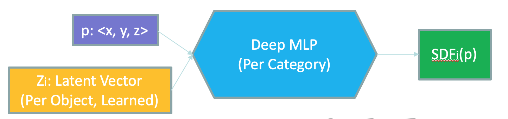
*A basic sketch of the DeepSDF architecture. We have a Multi-Layer Perceptron (MLP) that is trained per shape category and a latent vector trained per shape. At inference, MLP takes a 3D point with the embedding and gives the SDF value.*

DeepSDF allows training a single neural network for an entire database of shapes, in our case a database of shapes in a single category. Embedding vectors can be pretty small, like 128 or 256 dimensional. Even if shapes were represented as very small voxel grids of size 32x32x32, a single voxel grid would take up the space of 128 embeddings!

The authors solve three problems using their models. First, they try to compress a known category of shapes, measuring the accuracy of reconstruction using the shared neural network and embeddings. Then, they address the same problem with unknown shapes to assess the generalization capability of their model. Third, they attack the problem of shape completion, which is, as we will see, a very natural extension of the DeepSDF framework.

## Related Works

### Shape Representation
Previously, we discussed there are many alternatives for representing 3D shapes. Some of these representations are related to the DeepSDF approach, while others serve as a baseline for comparison.

Authors think three lines of work in shape representation is relevant. Namely point-based, mesh-based, and voxel-based ones.

#### Point-Based

Point clouds are one of the most popular data formats used in 3D. Point clouds represent shapes as unordered sets of 3D points on the surface. Very often, they are the raw data format obtained from modern depth sensors. The image in the left shows [an example point cloud of a torus object](http://sayef.tech/uploads/dynamic-graph-cnn/point-cloud-torus.png).

Recently, there is a hype around using them with neural networks, especially in 3D recognition [<a href="#c13">13</a>, <a href="#c14">14</a>]. In this line of work, people can reach good performance by using a sparse set of points (usually 1k to 4k points). At this common scale, point clouds are computationally efficient and compact.

The downside of point clouds is the lack of topology information. We have a bunch of points without any information on how these points are related to each other! For rendering point clouds at a reasonable resolution, we may require a lot of points (100k or more per shape in my experience). Moreover, the authors claim point clouds are not suitable for generating closed (watertight) surfaces.

#### Mesh-based

 

Polygonal Meshes represent shapes as groups of points that form polygons on the surface. A triangular mesh is the default data format used for rendering in modern graphics hardware, and much more efficient than point clouds in this use case. Synthetic 3D models created by artists are often in mesh format by default. On the right, you see [an example mesh that models a dolphin](https://en.wikipedia.org/wiki/Polygon_mesh).

In the world of meshes, one related work very similar to DeepSDF approach is AltasNet [<a href="#c2">2</a>]. This work also uses embeddings and shared neural networks. The standard AtlasNet first parameterizes 2D squares, and then deform them into 3D rectangles. Combining many of those squares, a 3D rectangular mesh is obtained. A sketch of the model architecture is seen below:

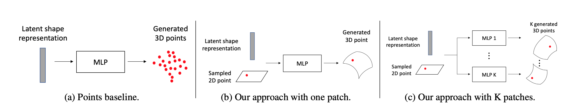
*AtlasNet deforms parametric squares to obtain 3D rectangular faces [<a href="#c2">2</a>].*

The aforementioned square-based AtlasNet approach cannot create closed surfaces. This is because combining many local deformed squares do not give any global completeness guarantees. To address this problem, they also define a version that deforms a parametric sphere. This version drops some fine details, but it can create closed surfaces.

#### Voxel-based

Voxels are simply 3D images. Instead of having pixels at each point of a 2D grid, we have a voxel at each point of a 3D grid. Voxels can be used to represent different data formats (including SDFs) as a function of discretized 3D grid coordinates.

Voxels are super-easy to work with using neural networks! Just replace all `Conv2D` and `BatchNorm2D` layers with `Conv3D` and `BatchNorm3D` layers (and all others end with 2D with 3D) and you have the architecture! The problem is their inefficiency. In 3D shapes, surfaces are often quadratic while volumes are often cubic (compare volume vs. area formula of cube and sphere). As we increase the voxel resolution, memory use increases faster than the number of voxels on the surface. Since surfaces are what we are most interested in, voxels waste our resources.

One important related work in voxel-based shape representation is the Octree-generating network(OGN) [<a href="#c3">3</a>]. OGN uses a hierarchical data representation called Octrees to generate shapes. OGN predicts both the structure and content of an octree with a convolutional neural network. Octrees can assign more voxels to more complex regions (e.g. the face of a human), and fewer voxels to simple regions (e.g. background). This adaptive resolution allows OGN to process high-resolution voxel grids efficiently.

 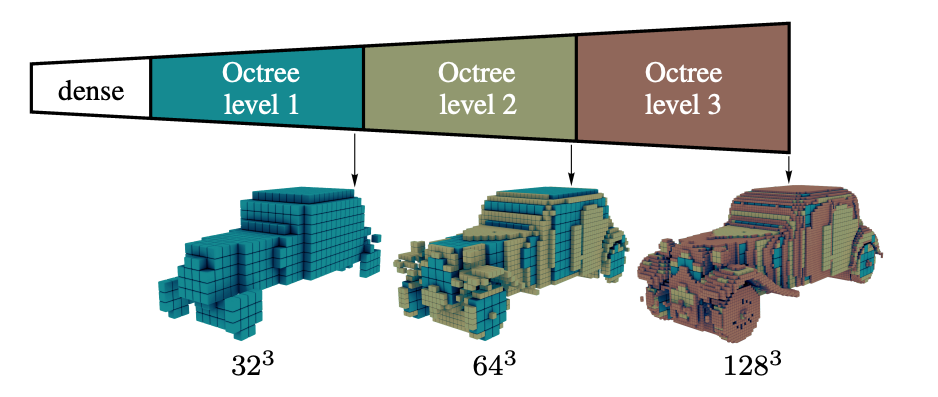
  
 <em>OGN makes prediction at multiple resolutions recursively [<a href="#c3">3</a>].</em>

 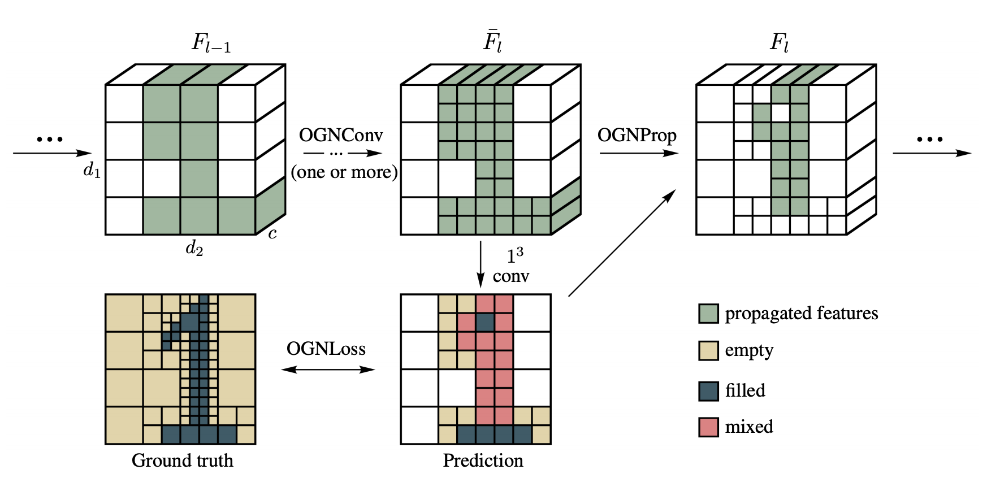
  
 <em>OGN learns the octree structure, using grount-truth structure at multiple resolutions [<a href="#c3">3</a>].</em>

### Generative Models
When it comes to popularity, generative models such as Generative adversatial networks (GANs) [<a href="#c6">6</a>] and variational auto-encoders (VAEs) [<a href="#c7">7</a>] form a hype. Here, the authors point out their architecture is a special kind of generative model, called Auto-Decoder. Authors discuss GANs and Auto-Encoders in addition to Auto-Decoder and try to ground their architecture choice. Images of auto-encoder and auto-decoder architectures taken from the paper [<a href="#c1">1</a>].

#### Generative Adversarial Networks
GANs learn to generate data from latent embeddings by training discriminators adversarially against generators. They are very successful at generating high-dimensional continuous data, especially at generating images. Although GANs can also be applied to the 3D domain, their adversarial training is known to be very difficult and unstable. 

#### Auto-Encoders
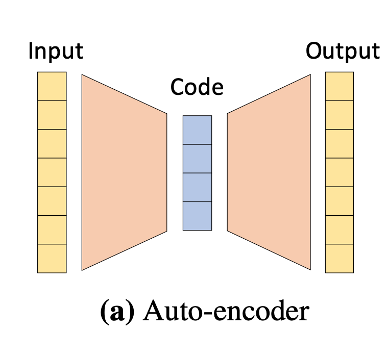

Auto-encoders learn to predict latent embeddings from the original input data using an encoder neural network. With the predicted latent code, the decoder network learns to reconstruct the original input. Auto-Encoders, especially the VAEs, used very commonly in 3D deep learning such as [<a href="#c15">15</a>, <a href="#c16">16</a>, <a href="#c17">17</a>]. However, authors state that in these works, only the decoder part is used at inference. A natural question is: Why training a large encoder network is necessary if we won't use it?

#### Auto-Decoders
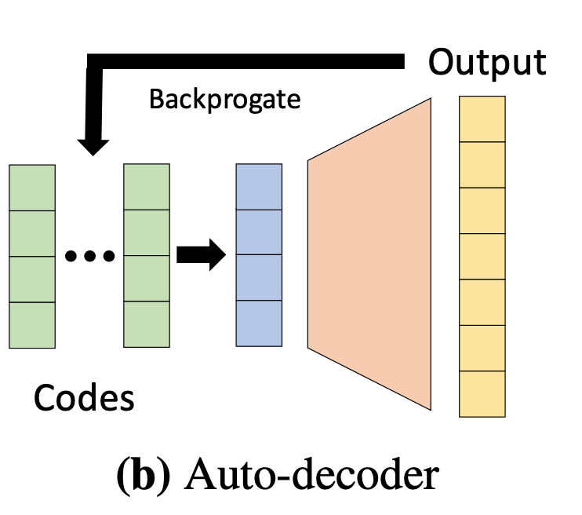

An Auto-Decoder is an auto-encoder without an encoder. It learns latent codes and a decoder for representing the data. Authors claim this architecture is easier to train compared to GANs and VAEs, and do not contain the unnecessary encoder module seen in Auto-Encoders.

The latent code learning can be understood as an `embedding_lookup` function that exits in common deep learning software. We have an embedding vector for each data point, each element of whom is initialized and learned as a model parameter.

### Shape Completion
For shape completion, the authors compare their results with an architecture called 3D-EPN [<a href="#c4">4</a>]. This architecture predicts a coarse, low-resolution voxel grid from an incomplete one. Then, they increase this resolution by retrieving and using reference shapes. Another significance of this approach is that it uses SDFs in the voxel form.

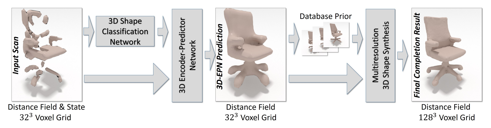
<em>3D-EPN architecture that completes the incomplete voxel grids [<a href="#c4">4</a>]. </em>

## Methodology
In this section, I discuss the authors' mathematical formulation of SDFs as neural networks. As the authors do in the paper, I first start with the naive idea of training a neural network per SDF, and then study the re-formulation as a generative model. I also explain the data generation process, model and training details they use. Formulas are from the paper [<a href="#c1">1</a>].

### SDFs as Neural Networks
We want a neural network model (or simply a parametric function approximator) that can produce signed distance values for a given point. Here, let's forget about shape databases and consider we have a single shape `X`. Our dataset is sampled from this shape, as ground-truth `(point, SDF(point))` pairs. We can now basically overfit a neural network to this shape. The resulting neural network becomes a continuous SDF representation.

DeepSDF technically learns a Truncated Signed Distance Function (TSDF). TSDF allows marking regions too far away from the surface as empty, making the SDF concentrate around the points in the surface, which are the ones that are important for rendering.

Now, let's go over the mathematical formulation of the ideas. We have a single shape that can be seen as a dataset of point-sdf pairs:

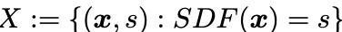

We want to approximate this dataset using a parametric function:

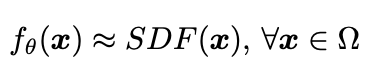

We can do so by optimizing the following loss function:

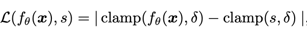

Above, the parameter `𝜹` controls the truncation distance, and `clamp(x, 𝜹) = min(𝜹, max(-𝜹, x))`. We can optimize parameters `𝜃` using gradient descent.

Clearly, this approach is not feasible. Yes, using voxels was inefficient, but so is having a several-million parameter neural network trained for each shape! This brings us to the auto-decoder based formulation.

### SDFs as Auto-Decoders

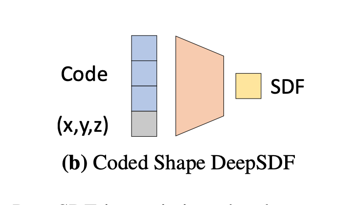

As noted before, DeepSDF can be seen as an auto-decoder. To be more specific, DeepSDF can be seen as a conditional auto-decoder. In this formulation, embedding vectors are latent codes, 3D points are conditions, and the neural network is the decoder. While a similar formulation is possible with other generative models, like GANs, authors chose to use an Auto-Decoder.

Here, we rather have an array of `X`s, while every `X` still is a shape with `(point, SDF(point))` pairs:

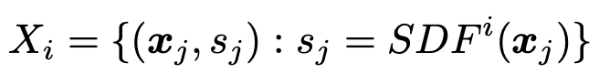

We have a single neural network per shape category and a set of latent vector `z`s, one vector per shape. To formulate this as a gradient-based optimization problem, we need to take a probabilistic perspective. The joint probability distribution of embedding vectors (`z`) and data (`X`) can be written as:

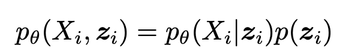

In the above formula, note that the likelihood term (distribution of `X` given the latent vector) is parameterized by `𝜃`. As our data consist of points and sdf values distributed independently, we can write the likelihood as a multiplication of point probabilities:

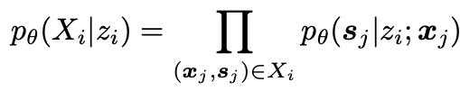

One can assume distribution is in the exponential form:

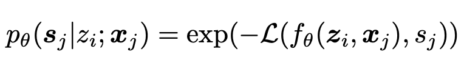

This is the common form many continuous distributions have, such as [Gaussian](https://en.wikipedia.org/wiki/Normal_distribution) and [Laplacian](https://en.wikipedia.org/wiki/Laplace_distribution). Note the loss function `L` appears in the exponent, which is replaced by the loss function introduced in the previous section.

We opt to optimize this joint distribution with `𝜃` and `z`, which is equivalent to maximum a posterior probability (MAP) estimation. Using lop probabilities, we can now optimize the parameters `𝜃`:

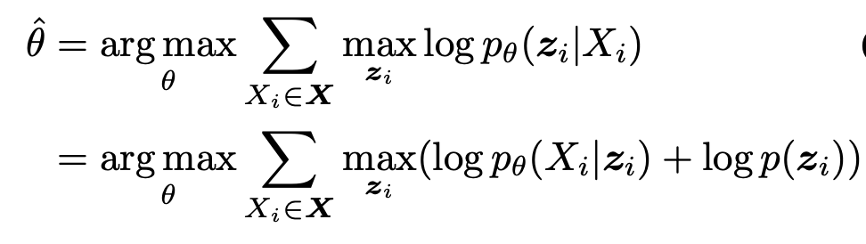

and also the embedding vectors `z`:

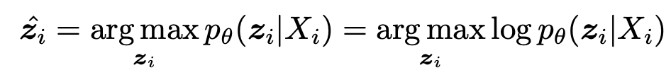

We can now pose a joint optimization problem over the entire dataset:

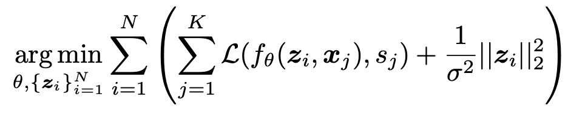

Note we assumed a Gaussian prior distribution over `z`. Using this formulation, latent vectors and neural network parameters are optimized using backpropagation and gradient descent.

The tricky situation here is to use this model at inference. If you have previous experience in embeddings used in natural language processing (NLP), you would note that the situation here is pretty different. In NLP, each embedding vector represents a discrete element (often a character or a word) coming from a finite vocabulary. Both training and test data in a particular language is a sequence of the same vocabulary. In the DeepSDF case, we can have infinitely many different objects in a category. We, therefore, cannot assume there is a finite vocabulary of possible objects.

What instead can be done is to optimize a new latent vector for the unknown shape. We freeze the network parameters. Using the fact that neural networks are differentiable with respect to their inputs, we optimize latent vectors using gradient-descent:

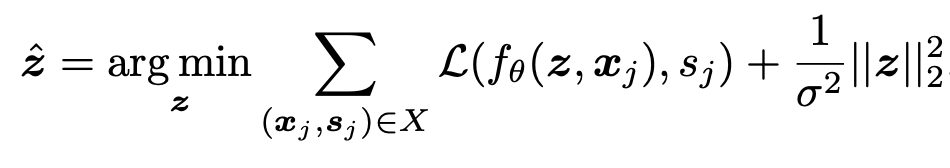

There are two very important points to make about the inference formula. First, ground-truth point-sdf pairs are available in inference time as well! However, these ground-truth points are available only for a sample of points, and we want to obtain the continuous function for the whole shape. Second, inference requires an entire training process with multiple backward passes of the network. This makes the model very slow at inference, probably the biggest downside of the DeepSDF approach.

### Dataset Preparation
Of course, having a model is not enough to do deep learning, we also need data! Similar to most other works in 3D deep learning, DeepSDF authors use a Computer-Aided Design (CAD) model dataset to obtain clean 3D shapes. In particular, they use the ShapeNet [<a href="#c11">11</a>] dataset, one of the most popular CAD model datasets available. They normalize shapes into the unit sphere and ensure all shapes have a canonical pose (there are no upside-down chairs!). This coordinate system should be kept in mind, several values including the truncation distance (e.g. 0.1) and all the performance metrics live in the unit sphere coordinate system!

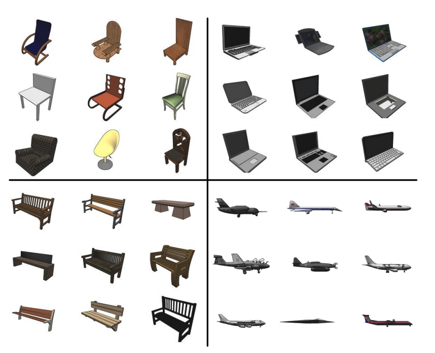
*ShapeNet is a rich CAD model dataset with aligned objects from multiple categories [<a href="#c11">11</a>]*

SDFs can be obtained from meshes, and as a synthetic dataset, ShapeNet consists of meshes. However, instead of using meshes, DeepSDF authors sampled a lot of points from different viewpoints and sampled SDFs around them! It is ironic that they technically used a point-based representation for data preparation, but we should note that the task is sampling data, not rendering. Having a discrete set of surface points is good to sample ground-truth SDF values, as one can simply sample other points and compute SDFs by finding the nearest surface point. They also needed to sample 250k points per shape (remember the point-cloud rendering discussion!).

Since authors want watertight (closed) surfaces being produced, they also employed a heuristic to eliminate non-watertight shapes. They do so by counting triangles whose different sides are observed from opposite views and eliminate the shapes where this count is large. This elimination is the major advantage of using a multi-view approach.

### Model and Training Details
In most of their experiments, authors used an 8-layer Fully Connected Network (or MLP) with a residual connection from input to layer 4.

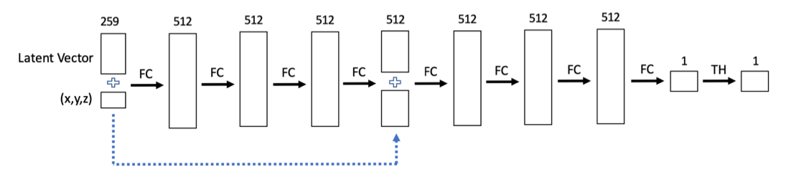
*The deep MLP architecture used in DeepSDF. Tanh (TH) activation is used in the output to obtain normalized coordinates [<a href="#c1">1</a>].*

Weight normalization [<a href="#c9">9</a>] instead of more popular batch normalization [<a href="#c10">10</a>]. The advantage of weight normalization over batch normalization is that it doesn't correlate different shapes with each other.

Adam optimizer [<a href="#c8">8</a>] with standard parameters is used. The truncation parameter `𝜹` is set to `0.1`, and latent vectors are initialized from a normal distribution with small variance (reportedly `0.001`). `Tanh` activation is used to ensure outputs are normalized. Training took 8 hours on 8 GPUs.

The authors made various ablation studies to justify their decisions. They showed, for example, that the residual connection is crucial for the optimization process, by conveying overfitting experiments at different model sizes.

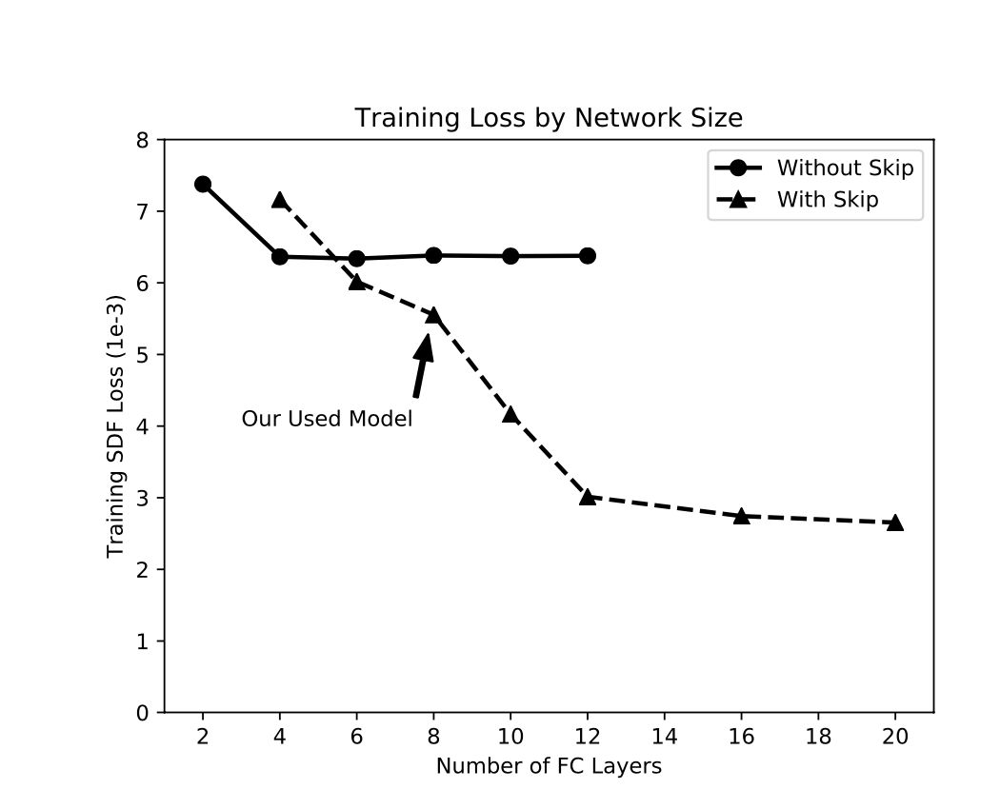
 
<em>Optimization difficulty when overfitting to 500 chairs. The residual connection allows larger models to overfit [<a href="#c1">1</a>].</em>

A very important ablation study that attracted my attention is the truncation parameter. One can see that larger truncation parameter values give worse results, as fewer resources are concentrated around the surfaces. In the end, shape representation is about representing surfaces. Clearly, though, we need to have a non-zero truncation distance for smoothness enabled by SDF representation. Hence, the selected `0.1` is a good choice.

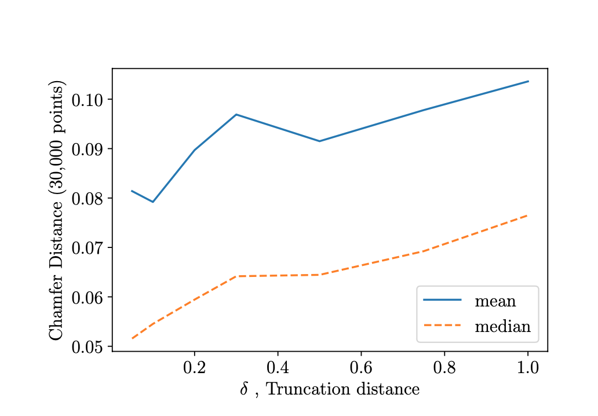
 
<em>Effect of truncation distance when overfitting to 100 cars [<a href="#c1">1</a>].</em>

## Experiments
Let's now see some experimental results! Authors attacked three main tasks in this paper: 
1) Representing known shapes
2) Representing unknown shapes
3) Shape completion. 
These tasks are quantitatively measurable. The quantitative results are compared against the baseline models introduced in the related work section. 

Apart from how DeepSDF scores, I also opt to discuss two other important experiments in this post. The first one is that the quantitative results that show latent codes can be interpolated to obtain new shapes, something you see in all embedding papers. The second one is how noise affects the model performance, which I think is very interesting!

I also add discussions regarding performance metrics and evaluation methods at the beginning, and computational efficiency at the end.

### Performance Metrics
Before delving deep into experiments, I first want to introduce the evaluation metrics used in the paper. Besides their use in the paper, these metrics are relevant for a wide variety of shape completion tasks, so it's beneficial to learn what they are. Figures are formulas are from the paper [<a href="#c1">1</a>].

#### Chamfer Distance(CD)
Chamfer Distance is the most frequently used metric in this paper. It is defined over two discrete sets of points defined over two surfaces `S1` and `S2`. Its formula is given by:
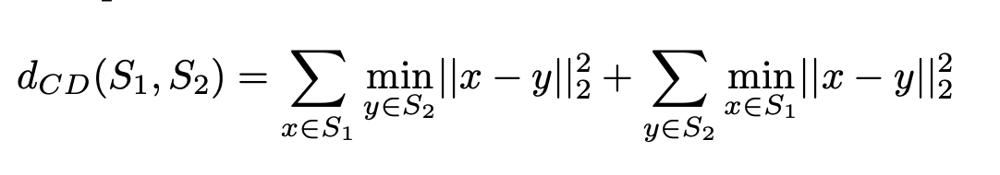

Chamfer Distance can be viewed as a bidirectional nearest neighbor computation. We first sum distance of each point in the surface `S2` to its nearest neighbor in the surface `S1` and then sum the distance of each point in `S1` to its nearest neighbor in `S2`. 

Although CD is [symmetric](https://en.wikipedia.org/wiki/Symmetric_function), it is not a valid distance function as it does not satisfy [the triangle inequality](https://en.wikipedia.org/wiki/Triangle_inequality). Although it is a very useful metric, one should keep this in mind!

In this paper, CD is used with a sample of 30k points and computed in `O(nlogn)` using [`KDTree`](http://pointclouds.org/documentation/tutorials/kdtree_search.php). It is also normalized, i.e. the sum given in the formula is divided by the number of points.

#### Earth Mover's Distance (EMD)
Earth Mover's Distance, or Wasserstein's Distance, is defined over equal-size point sets on surfaces `S1` and `S2` as:

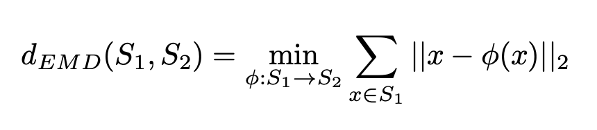
 
Intuitively, EMD is the minimum amount of total change we have to make to move all points in `S1` to `S2`. Computing the EMD is an instance of the commonly known transportation problem, a common problem studied in linear programming literature. See [this](http://infolab.stanford.edu/pub/cstr/reports/cs/tr/99/1620/CS-TR-99-1620.ch4.pdf) lecture notes for further details.

The advantage of using EMD over CD is that it guarantees one-to-one correspondence between points. While one point in `S1` can correspond to a cluster of points in `S2` when using CD, in EMD this is not possible. The downside of EMD is being inefficient to compute.

Although efficient approximations are available, authors wanted to compute full EMD. Therefore, they sampled just 500 points from the solution and the ground-truth and compute EMD from them. As in CD, the measure is normalized.

#### Mesh Accuracy
Mesh accuracy is the closest distance from the ground-truth mesh that covers 90% of the points. While CD and EMD are computed based on sampled points from ground-truth and generated surfaces, mesh accuracy directly uses the closest distance to the mesh. Hence, it has a lower variance compared to CD and EMD. The downside of Mesh Accuracy is that it doesn't measure how complete the mesh is. This metric can be fooled easily, e.g. by generating all points close to a single face! Therefore it is not meaningful on its own.

#### Mesh Completion
This metric should be used in conjunction with mesh accuracy. We simply compute mesh accuracy of ground-truth points using the generated mesh as the target. It has a role similar to the second sum of CD.

#### Mesh Cosine Similarity
If you studied computer graphics, you know that faces in a mesh also have normal vectors. Mesh Cosine Similarity compares normal vectors of the generated mesh with the ground-truth normal vectors (obtained from the ground-truth mesh). Its formula is:

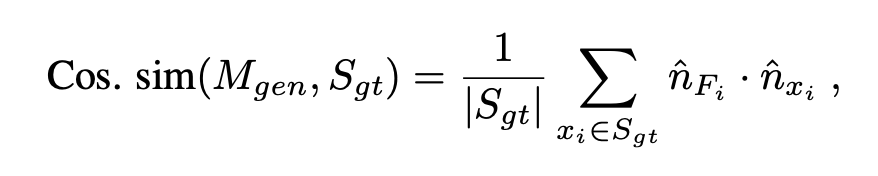

### How They Evaluate?
For quantitative evaluations, they obtain a voxel grid of size `512x512x512` by evaluating SDF on a spatial grid. They then used Marching Cubes[<a href="#c12">12</a>] algorithm to create an output mesh. For quantitative renderings, they directly rendered from the continuous representation using Ray Casting. ShapeNet version 2 is used for shape representation experiments, while version 1 is used for shape completion to be comparable with the 3D-EPN baseline.

### Representing Known Shapes
Technically, we don't have to use neural networks for machine learning. They are simply nonlinear function approximators. Anywhere we need to approximate a function, we can use them! Representing known shapes is a non-learning task, where we address compression of a known shape database. 3D data are complex, so this overfitting task is still very difficult.

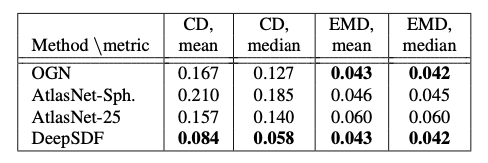

*DeepSDF outperforms AtlasNet, AtlasNet Sphere and OGN when overfitting to known shapes*

Here, what authors do is to directly follow the auto-decoder based training formulation. They optimize one latent vector per shape and a network per shape category. They then reconstruct surfaces using their trained models and embeddings, reporting better scores in CD and EMD metrics compared to baseline models. They use a latent vector size of 256.

### Representing Unknown Shapes
And now, we do actual learning! We have the same training method in the previous section, but this time we don't know the shape embeddings. Therefore, we just optimize the shape embeddings at inference. We train an Adam optimizer similar to training, but by freezing network parameters and only optimizing the latent vectors. Again DeepSDF outperforms the baseline models in EMD and CD metrics. The latent vector size is again 256.

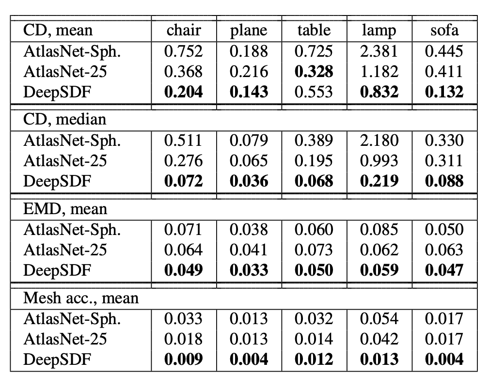
 
<em>DeepSDF outperforms baseline methods when learning a new latent code for unknown shapes [<a href="#c1">1</a>].</em>

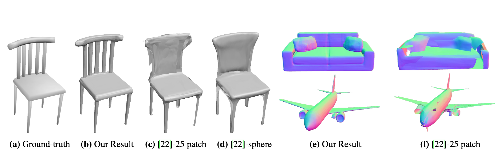
*DeepSDF can produce better qualitative results compared to baselines [<a href="#c1">1</a>].*

One very weird detail we have here is that we assume we have some ground-truth samples of SDF values for the shape! They basically show latent code can represent a continuous SDF from discrete samples, and a new latent code can be obtained from these discrete samples. We can see that by looking back to the inference formula:

Is this really learning or do we still overfit? It depends on your viewpoint.

### Shape Completion
A very natural extension of DeepSDF method is shape completion. More specifically, we now have a single depth camera image and try to obtain the whole shape from it. The details of surface elements not visible are missing.

I think this is the most interesting problem they attempt to solve. We now don't have ground-truth SDF values to represent all faces of a surface, we have some hidden faces! Therefore, the model has to learn SDF values around those faces.

The approach the authors used for shape completion naturally follows the inference formulation. We again have some point-sdf samples and we optimize a latent vector for them. We then forward pass our deep neural network for points evenly sampled around the unit sphere coordinate system. Thus, we have the complete shape! The major difference, as stated, is the ground-truth SDF values are only the ones visible from a camera. Different from the previous two experiments, 128-dimensional latent vectors are used.

DeepSDF outperforms the 3D-EPN baseline in CD, EMD, and mesh-based metrics. This superiority can also be seen qualitatively in the selected sample shapes the authors have shown.

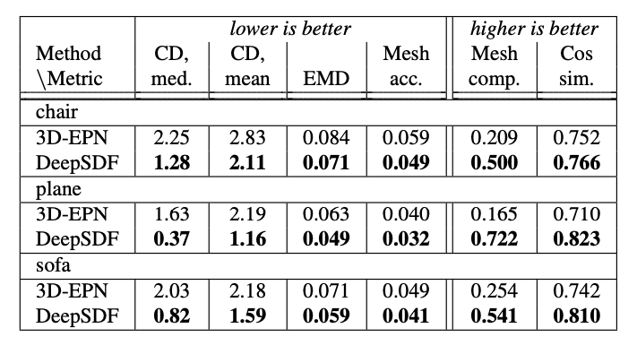
 
<em>DeepSDF [<a href="#c1">1</a>] outperforms 3D-EPN [<a href="#c4">4</a>] baseline</em>

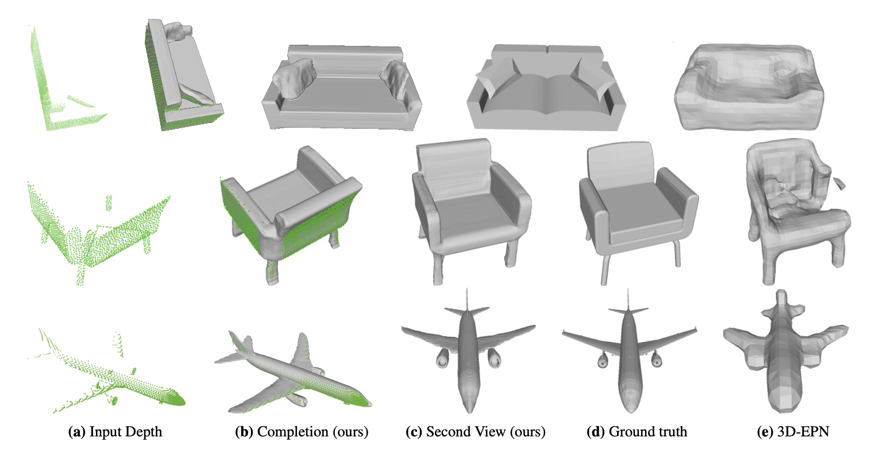
<em>Qualitatively, fine details obtained better compared to 3D-EPN [<a href="#c1">1</a>, <a href="#c4">4</a>]. </em>

### Qualitative Results on Embeddings
As in all embedding papers, authors show their embeddings can be interpolated linearly. An automobile is the average of a pickup and an SUV, and averaging wooden chair and a single-person sofa create a chair whose sides a closed like a sofa.

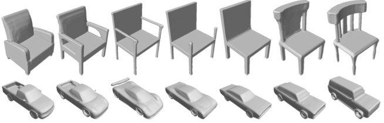

*Embedding vectors can be interpolated linearly to create new shapes [<a href="#c1">1</a>].*

### Effect of Noise
Although the authors chose the discuss the effect of noise in the supplementary section, I think this is something very important in terms of generalization capabilities of the model.

For assessing the effect of noise, authors picked the shape completion task and they injected Gaussian noise to depth maps. With an increasing standard deviation, the depth maps divergence from the correct shape is faster than the divergence of DeepSDF-generated shapes. That is, the DeepSDF can still produce high-quality shapes even if the noise corrupted the depth maps significantly. This is a very interesting result!

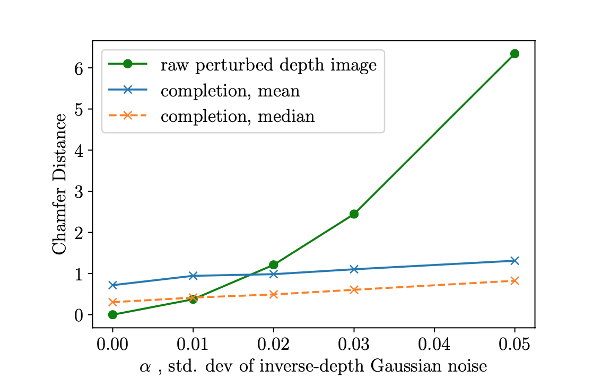
 
<em>CD change by noise, depth images vs. generations [<a href="#c6">1</a>].</em>

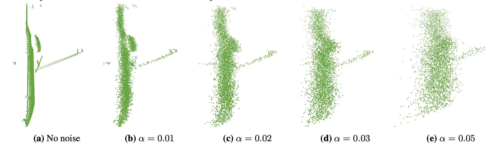
<em>Example airplane depth images subjected to noise [<a href="#c1">1</a>]. </em>

The authors claim this shows the "regularization effect" of DeepSDF, something that suggests DeepSDF has good generalization properties. If that is true, then great! However, I have to admit the results look too good to be true. Further measurements should be done before claiming the model really generalizes well or not. One experiment that comes to my mind is measuring the distance of generated shapes to the closest example in training data. The model could be just copying and pasting!

My criticism aside, the robustness of the model to noise is still something very desirable. It is very beneficial that the authors conveyed these experiments in my opinion.

### Computational and Memory Efficiency

When talking about 3D vision models, computational efficiency is something one should care about for real-world usability. The table below compares memory use and computational speed:

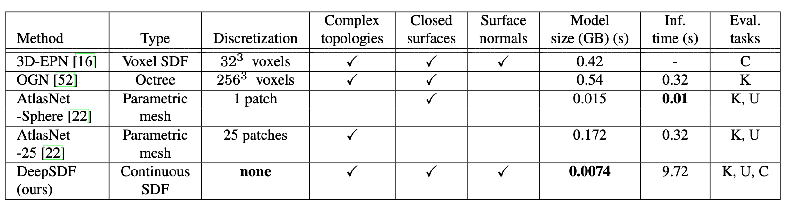
*Model size and inference time of different models. K and U stand for representing known and unknown shapes. C stands for shape completion [<a href="#c1">1</a>, <a href="#c2">2</a>, <a href="#c3">3</a>, <a href="#c4">4</a>].*

The model has a significant advantage in terms of memory use compared to other models. However, inference time is really poor, since an iterative neural network optimization (Adam) must be done at inference!

## Conclusion

### Author's Conclusions
DeepSDF outperforms baseline models in shape compression and completion. It can represent closed surfaces, fine details, and complex topologies. However, they stress that the inference procedure is very slow since a neural network optimization must be done. They point out a better optimization procedure, like Gauss-Newton, can be used to replace the current, inefficient process.

DeepSDF has significant memory advantage over previous methods, while also avoiding the discretization errors. In future applications, this can also be useful in representing wild 3D scenes with multiple shapes. However, DeepSDF paper only studies the shapes in canonical poses. Authors state that SE(3) transformation increases the complexity of the inference process by introducing an additional optimization challenge. They also note that dynamics and textures in wild scenes will increase the complexity of the latent space, posing a major challenge for future explorations.

### My Additions
In addition to conclusions authors reached, I have some additions.

I think, DeepSDF can be used in many interesting applications in 3D deep learning such as single-view 3D reconstruction, joined natural language processing and 3D, and many more. As the challenges authors pointed out in their conclusions being solved, these applications become more and more feasible. 

In my opinion, one downside of DeepSDF is that it is unclear how to use it in practical applications without discretization. How should I input a DeepSDF to another neural network without converting it to a set of points or a voxel grid? Considering authors stress a lot that their approach avoid discretization errors, this is a very important open problem for the future.

## References 
<ol>
<li id="c1">Park, Jeong Joon, et al. "DeepSDF: Learning Continuous Signed Distance Functions for Shape Representation." Proceedings of the IEEE Conference on Computer Vision and Pattern Recognition. 2019.</li>
<li id="c2">Groueix, Thibault, et al. "A papier-mâché approach to learning 3d surface generation." Proceedings of the IEEE conference on computer vision and pattern recognition. 2018.</li>
<li id="c3">Tatarchenko, Maxim, Alexey Dosovitskiy, and Thomas Brox. "Octree generating networks: Efficient convolutional architectures for high-resolution 3d outputs." Proceedings of the IEEE International Conference on Computer Vision. 2017.</li>
<li id="c4">Dai, Angela, Charles Ruizhongtai Qi, and Matthias Nießner. "Shape completion using 3d-encoder-predictor cnns and shape synthesis." Proceedings of the IEEE Conference on Computer Vision and Pattern Recognition. 2017.</li>
<li id="c5">Ahmed, E., et al. "Deep Learning Advances on Different 3D Data Representations: A Survey. arXiv 2018." arXiv preprint arXiv:1808.01462.</li>
<li id="c6">Goodfellow, Ian, et al. "Generative adversarial nets." Advances in neural information processing systems. 2014.</li>
<li id="c7">Kingma, Diederik P., and Max Welling. "Auto-encoding variational bayes." arXiv preprint arXiv:1312.6114 (2013).</li>
<li id="c8">Kingma, Diederik P., and Jimmy Ba. "Adam: A method for stochastic optimization." arXiv preprint arXiv:1412.6980 (2014).</li>
<li id="c9">Salimans, Tim, and Durk P. Kingma. "Weight normalization: A simple reparameterization to accelerate training of deep neural networks." Advances in Neural Information Processing Systems. 2016.</li>
<li id="c10">Ioffe, Sergey, and Christian Szegedy. "Batch normalization: Accelerating deep network training by reducing internal covariate shift." arXiv preprint arXiv:1502.03167 (2015).</li>
<li id="c11">Chang, Angel X., et al. "Shapenet: An information-rich 3d model repository." arXiv preprint arXiv:1512.03012 (2015).</li>
<li id="c12">Lorensen, William E., and Harvey E. Cline. "Marching cubes: A high resolution 3D surface construction algorithm." ACM siggraph computer graphics. Vol. 21. No. 4. ACM, 1987.</li>
<li id="c13">Qi, Charles R., et al. "Pointnet: Deep learning on point sets for 3d classification and segmentation." Proceedings of the IEEE Conference on Computer Vision and Pattern Recognition. 2017.</li>
<li id="c14">Qi, Charles Ruizhongtai, et al. "Pointnet++: Deep hierarchical feature learning on point sets in a metric space." Advances in neural information processing systems. 2017.</li>
<li id="c15">Bagautdinov, Timur, et al. "Modeling facial geometry using compositional vaes." Proceedings of the IEEE Conference on Computer Vision and Pattern Recognition. 2018.</li>
<li id="c16">Bloesch, Michael, et al. "CodeSLAM—learning a compact, optimisable representation for dense visual SLAM." Proceedings of the IEEE Conference on Computer Vision and Pattern Recognition. 2018.</li>
<li id="c17">Litany, Or, et al. "Deformable shape completion with graph convolutional autoencoders." Proceedings of the IEEE Conference on Computer Vision and Pattern Recognition. 2018.</li>
</ol>